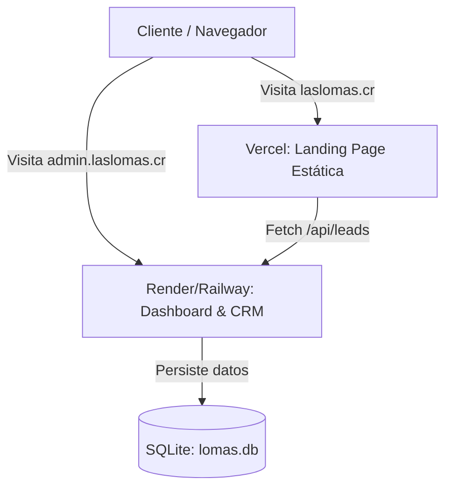

# 🚀 Guía de Despliegue · LAS LOMAS

Esta guía detalla el proceso paso a paso para desplegar y configurar la infraestructura de **LAS LOMAS** en producción utilizando una arquitectura de subdominios en un mismo dominio personalizado (por ejemplo, `laslomas.cr`).

---

## 📐 Arquitectura de Producción

Para garantizar velocidad, estabilidad y seguridad, el proyecto se divide en dos componentes independientes que se comunican de forma segura:



1. **Frontend (Landing Page)**:
   * **URL**: `https://laslomas.cr` (y `https://www.laslomas.cr`).
   * **Alojamiento**: **Vercel** (desplegado estáticamente desde la carpeta `/website`).
   * **Características**: Extremadamente rápido, seguro y con caché global (CDN).
2. **Backend (CRM, Gantt, Finanzas e API)**:
   * **URL**: `https://admin.laslomas.cr` (o `https://crm.laslomas.cr`).
   * **Alojamiento**: **Render.com**, **Railway.app** o **Fly.io** (alojamiento de contenedores con disco persistente).
   * **Características**: Servidor Python FastAPI que lee/escribe sobre la base de datos persistente `lomas.db`.

---

## 📦 Paso 1: Despliegue de la Landing Page en Vercel

Dado que la landing page ya está vinculada al proyecto `las-lomas` en Vercel, actualizarla es muy sencillo.

### Despliegue desde tu computadora
Cada vez que realices cambios en el sitio web (diseño, textos, imágenes en la carpeta `website`), abre una terminal en la raíz del proyecto y ejecuta:

```bash
# Cambiar al directorio del sitio web
cd website

# Desplegar a producción
vercel --prod
```

### Configuración del Dominio en Vercel
1. Ve al panel de control de Vercel (https://vercel.com) de tu proyecto **las-lomas**.
2. Dirígete a **Settings > Domains**.
3. Añade tu dominio personalizado (ej. `laslomas.cr`). Vercel te dará las instrucciones para configurar las DNS en tu proveedor (usualmente un registro `A` apuntando a las IPs de Vercel o un registro `CNAME` para el subdominio `www`).

---

## 🖥️ Paso 2: Despliegue del Backend & CRM Dashboard

El backend de Python (`main.py`) **requiere un servidor persistente** porque utiliza una base de datos SQLite (`lomas.db`). 

> [!WARNING]
> **No despliegues el backend completo en Vercel.** Las funciones *serverless* de Vercel son de solo lectura y efímeras; cualquier cambio en la base de datos (nuevos prospectos, tareas añadidas, registros financieros) se borrará cada pocos minutos.

### Opción Recomendada: Desplegar en Render.com

1. **Crear una cuenta** en [Render.com](https://render.com) y conectar tu cuenta de GitHub.
2. **Crear un nuevo servicio**:
   * Haz clic en **New + > Web Service**.
   * Conecta tu repositorio de GitHub `macastro80-creator/Las-Lomas`.
3. **Configurar las propiedades del servicio**:
   * **Environment**: `Python`
   * **Build Command**: `pip install -r requirements.txt`
   * **Start Command**: `uvicorn main:app --host 0.0.0.0 --port $PORT`
4. **Habilitar Persistencia (Crucial para SQLite)**:
   * En la configuración del servicio, ve a la sección **Disk** (Disco persistente).
   * Haz clic en **Add Disk**.
   * Configura:
     * **Name**: `lomas-db-volume`
     * **Mount Path**: `/data`
     * **Size**: `1 GiB` (es más que suficiente para SQLite).
5. **Ajuste de Variables de Entorno**:
   * Ve a **Environment Variables** en Render y añade:
     * `DATABASE_NAME` = `/data/lomas.db`
     * *(Esto redirige la base de datos de la aplicación al disco persistente para que no se borre al reiniciar el servidor)*.

---

## 🌐 Paso 3: Configuración de DNS & Subdominios

Para enlazar todo bajo tu propio dominio (ej. `laslomas.cr`), debes entrar al proveedor donde compraste tu dominio (GoDaddy, Namecheap, Cloudflare, etc.) y configurar los siguientes registros DNS:

| Tipo | Host | Valor / Destino | Propósito |
| :--- | :--- | :--- | :--- |
| **A** | `@` | `76.76.21.21` *(IP de Vercel)* | Landing page principal |
| **CNAME** | `www` | `cname.vercel-dns.com.` | Redirección www |
| **CNAME** | `admin` | *URL que te asigne Render* (ej. `las-lomas.onrender.com`) | Backend, API y CRM |

Una vez propagados los DNS, tu panel interno estará disponible en `https://admin.laslomas.cr`.

---

## 🛠️ Paso 4: Ajustes Finales y Mantenimiento

### 1. Actualizar el endpoint de captación en el sitio web
Si decides usar un subdominio diferente a `admin.laslomas.cr` (por ejemplo, `crm.laslomas.cr`), debes actualizar la dirección a la que apunta el formulario de la landing page en:

* **Archivo**: [`website/index.html`](file:///Users/alejandracastro/Desktop/Las%20Lomas/website/index.html#L372)
* **Línea**: 372
* **Código**:
  ```javascript
  const apiEndpoint = isLocal ? '/api/leads' : 'https://TU-SUBDOMINIO.laslomas.cr/api/leads';
  ```

Una vez que modifiques esta línea, recuerda redesplegar la landing page con `cd website && vercel --prod`.

### 2. Actualizar CORS en el Backend
Para mantener la seguridad, el backend solo acepta peticiones de los dominios autorizados. Si cambias de dominio, debes actualizar la lista de orígenes permitidos en:

* **Archivo**: [`main.py`](file:///Users/alejandracastro/Desktop/Las%20Lomas/main.py#L20-L28)
* **Código**:
  ```python
  allow_origins=[
      "https://tu-landing-page.vercel.app",
      "https://laslomas.cr",
      "https://www.laslomas.cr",
      "http://localhost:8000",
      "http://127.0.0.1:8000"
  ]
  ```

---

## 🔄 Flujo de Trabajo Diario para Cambios

Cuando realices modificaciones en el código de tu proyecto:

1. **Para cambios en la Landing Page (Estáticos)**:
   ```bash
   cd website
   vercel --prod
   ```
2. **Para cambios en el Backend (CRM / Gantt / Finanzas)**:
   Realiza tus commits y empújalos a GitHub:
   ```bash
   git add -A
   git commit -m "feat: descripción del cambio"
   git push origin main
   ```
   *Render detectará automáticamente el push en la rama `main` y redesplegará el servidor en pocos minutos sin afectar la base de datos persistente.*
